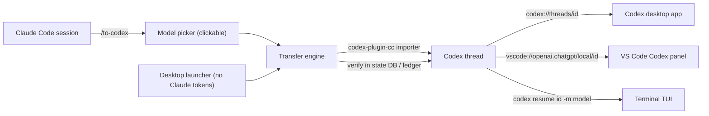
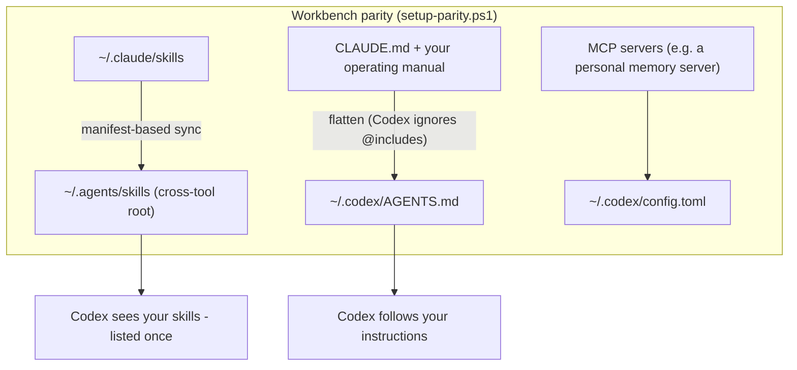

<p align="center">
  <picture>
    <source media="(prefers-color-scheme: dark)" srcset="assets/logo-dark.png">
    
  </picture>
</p>

<p align="center">
  <b>One command to hand a live Claude Code session to OpenAI Codex — conversation, skills, instructions, and memory intact.</b>
</p>

<p align="center">
  <a href="LICENSE"></a>
  
  
  
</p>

---

Running out of Claude Code tokens mid-task? Want a second model's opinion with your whole working context? **claude-codex-bridge** turns "switch to Codex" into a single step:

```
/to-codex
```

…and the OpenAI **Codex desktop app opens directly on your transferred conversation**, with the same skills, the same operating instructions, and the same memory layer your Claude Code sessions use. A desktop launcher does the same thing **without spending a single Claude token** — it works even when Claude Code is rate-limited or closed.

## Why this exists (and why not just use the official plugin)

OpenAI's [codex-plugin-cc](https://github.com/openai/codex-plugin-cc) provides `/codex:transfer` — and this kit uses its importer as the transfer engine. But by itself, on Windows, the experience breaks down in ways this kit fixes. Every fix below was diagnosed and verified on a real machine (see [docs/TESTING.md](docs/TESTING.md)):

| Problem | Official plugin | This kit |
|---|---|---|
| Windows transfer reports **false failure** ([#513](https://github.com/openai/codex-plugin-cc/issues/513) — thread is actually created) | Open bug | Detects the imported thread directly in Codex's state DB; trusts evidence, not the broken success message |
| Re-transferring an **unchanged session** creates no thread (content-hash dedupe) and looks like a failure | Unhandled | Reads Codex's import ledger and reuses the existing thread, telling you so |
| `codex` **not on PATH** for spawned shells (npm installs inside an app container are invisible outside it) | Unhandled | Resolves an absolute path to the standalone vendored `codex.exe` that is real for every process |
| Where does the session **open**? | Prints a command | Deep-links straight into the **Codex desktop app** (`codex://threads/<id>`) or the **VS Code Codex panel** (`vscode://openai.chatgpt/local/<id>`), falling back to a terminal TUI — your choice |
| Model choice | Config default | Clickable model picker at transfer time (`-m` per invocation for the TUI; app/panel keep their own selector) |
| Out of Claude tokens entirely? | Unusable (needs a live Claude session) | Desktop launcher with a session picker — zero Claude tokens involved |
| Codex knows your workflow? | Out of scope | Parity sync: flattened instructions + your skills served to Codex from the cross-tool `~/.agents/skills` root |

## See it in action





## Components

| Component | What it does |
|---|---|
| `skill/to-codex/` | Claude Code skill: locate the live transcript, clickable model pick, transfer, open in Codex |
| `scripts/transfer-to-codex.ps1` | The engine: import via codex-plugin-cc, verify the thread independently, launch app / VS Code / terminal |
| `scripts/codex-thread-query.py` | Read-only queries against Codex state (newest thread, import ledger lookups, thread cwd) |
| `scripts/switch-to-codex.ps1` | GUI launcher: recent-session picker + model + effort + destination. No Claude tokens needed |
| `scripts/setup-parity.ps1` | Keeps Codex in parity: installs your flattened AGENTS.md, syncs skills with adaptation-safe manifest logic |
| `AGENTS.md.example` | A complete, real-world example of flattened cross-agent instructions (including a full operating manual) |

## Quick Start

### Prerequisites
- Windows, PowerShell 5.1+, Python 3.x, Node 18.18+
- [Codex CLI](https://developers.openai.com/codex) (`npm i -g @openai/codex`) with a ChatGPT subscription or OpenAI API key
- [Claude Code](https://claude.com/claude-code)
- The official plugin (the transfer engine):
```bash
claude plugin marketplace add openai/codex-plugin-cc
```
```bash
claude plugin install codex@openai-codex
```

### Option 1 — Full kit (recommended)
```powershell
git clone https://github.com/AndrewAvery7/claude-codex-bridge.git
Copy-Item -Recurse claude-codex-bridge\scripts "$env:USERPROFILE\.claude\codex-parity"
Copy-Item -Recurse claude-codex-bridge\skill\to-codex "$env:USERPROFILE\.claude\skills\to-codex"
```
Create your `AGENTS.md` from `AGENTS.md.example`, then:
```powershell
powershell -ExecutionPolicy Bypass -File "$env:USERPROFILE\.claude\codex-parity\setup-parity.ps1"
```
Optionally create a desktop shortcut to `switch-to-codex.ps1` (see [docs/DESIGN.md](docs/DESIGN.md#desktop-launcher)).
Then, in any Claude Code session: **`/to-codex`**.

### Option 2 — Transfer engine only
Skip parity; just get reliable session hand-off:
```powershell
powershell -File scripts\transfer-to-codex.ps1 -Source "<path-to-claude-session.jsonl>" -Model gpt-5.6-sol
```
The source must live under `~/.claude/projects` (importer requirement). `-OpenIn auto|app|vscode|terminal|none`.

### Option 3 — Parity sync only
Just make Codex mirror your Claude Code skills and instructions:
```powershell
powershell -File scripts\setup-parity.ps1 -SanityCLIs @('your-cli-1','your-cli-2')
```

## Good to know
- **Transfers are snapshots.** Anything said in Claude after the transfer is not in the Codex thread. Transfer last — or re-transfer (unchanged content reuses the same thread; changed content creates a new one).
- **Model selection**: the `-m` flag applies to the terminal resume command. The desktop app and VS Code panel each have their own model dropdown — pick there.
- **Never put skills in `~/.codex/skills`.** Codex scans both that and `~/.agents/skills`; a skill in both is listed twice. The sync script guards against this.
- **Adapted skills are sacred.** If you hand-tune a skill copy for Codex (e.g. "dispatch Codex subagents" instead of Claude ones), the manifest logic will never overwrite it.

## Documentation
- [docs/DESIGN.md](docs/DESIGN.md) — architecture and the reasoning behind every workaround: the false-failure diagnosis, the dedupe ledger, the app-container PATH trap, how the deep-link routes were found
- [docs/TESTING.md](docs/TESTING.md) — the full verification matrix: what was tested, how, and what proved it
- [docs/TROUBLESHOOTING.md](docs/TROUBLESHOOTING.md) — common failure modes and exact fixes
- [CHANGELOG.md](CHANGELOG.md)

## Technology
PowerShell 5.1 · Python 3 · [codex-plugin-cc](https://github.com/openai/codex-plugin-cc) (Apache-2.0, the transfer engine) · [Codex CLI](https://developers.openai.com/codex) · [Agent Skills open standard](https://agentskills.io) (`SKILL.md`) · Codex deep-link protocols (`codex://`, `vscode://openai.chatgpt/`)

## Caveats (honest edges)
- **Windows-only** as shipped (paths, PowerShell, MSIX specifics). The design ports to macOS/Linux; PRs welcome.
- Relies on **undocumented Codex internals**: the `state_5.sqlite` threads schema, the `external_agent_session_imports.json` ledger, and the deep-link routes. Verified against Codex CLI 0.145 / VS Code extension 26.721 / plugin 1.0.6 — future Codex updates could move these. The terminal resume command printed on every transfer is the always-works fallback.
- The transfer converts between two different agent formats; the conversation arrives as visible, continuable turns, but tool-call internals are thinned by the importer.

## Acknowledgements
- **[openai/codex-plugin-cc](https://github.com/openai/codex-plugin-cc)** (Apache-2.0) — the official Claude Code plugin whose session importer powers the transfer step. This kit wraps it and works around [#513](https://github.com/openai/codex-plugin-cc/issues/513) rather than replacing it. Install it from OpenAI's marketplace; none of its code is bundled here.
- The **[Agent Skills](https://agentskills.io)** open standard, which makes one `SKILL.md` work across Claude Code, Codex, and 30+ agents.

## License
[MIT](LICENSE) © 2026 AndrewAvery7
